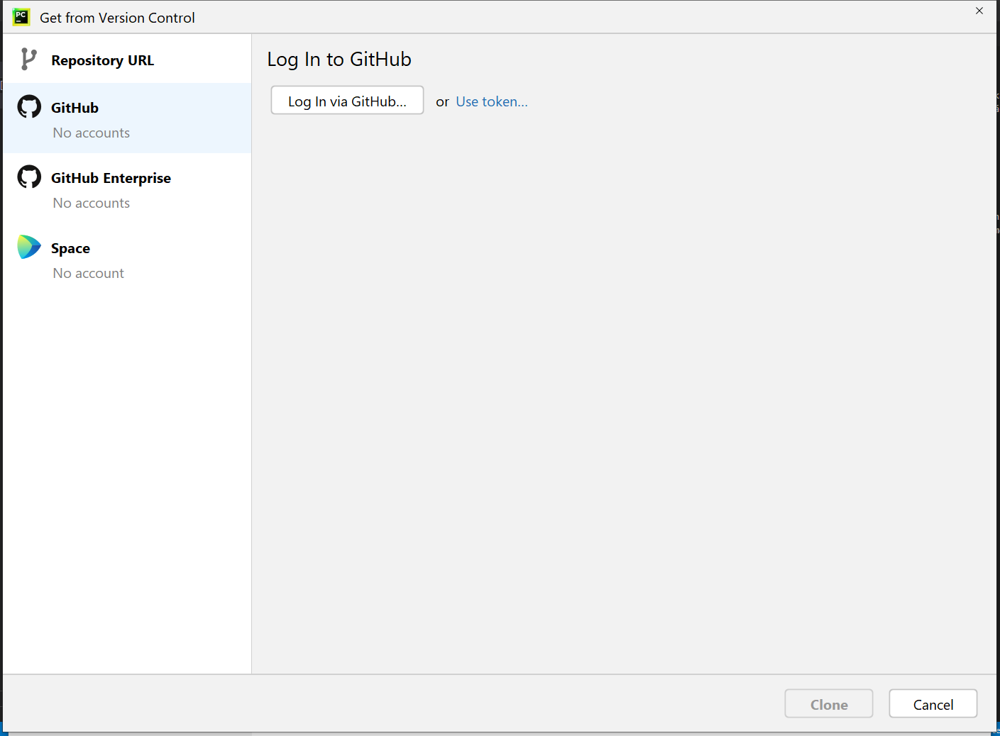
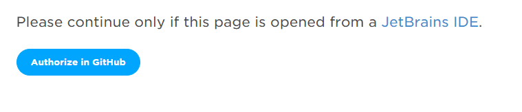
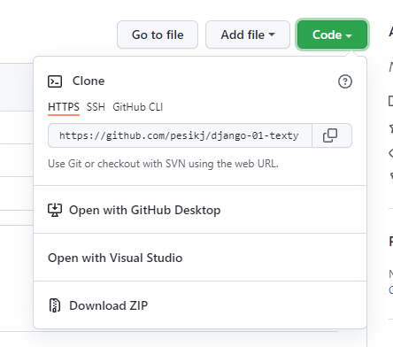
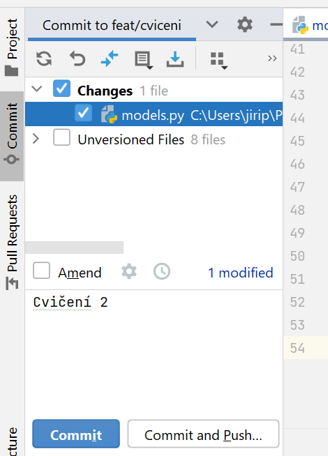

# Texty k jednotlivým lekcím

* [Lekce 1 (Stuktura naší aplikace, opakování, Git a GitHub)](lekce_01.md)
* [Lekce 2 (CSS a Bootstrap)](lekce_02.md)
* [Lekce 3 (Uživatelské účty)](lekce_03.md)
* [Lekce 4 (Registrace uživatelů, rozšíření modelu uživatele, zprávy)](lekce_04.md)
* [Lekce 5 (Úprava administrátorského rozhraní, automatické testy)](lekce_05.md)
* [Lekce 6 (Překlady, import dat, requirements, výchozí hodnoty)](lekce_06.md)
* [Lekce 7 (Sítě, HTTP protokol, deployment)](lekce_07.md)
* [Lekce 8 (Registrace uživatele, modul django-crispy-forms, Django REST Framework)](lekce_08.md)
* [Lekce 9 (HTML editor, časové zóny, modul django-tables2, filtry, nahrávání souborů)](lekce_09.md)
* Lekce 10 (JavaScript, statické soubory, cookies a relace, grafy a vizalizace)

# Práce s Gitem

Práce s Gitem je v PyCharmu relativně jednoduchá. Nejprve je potřeba zvolit službu, kterou budeme používat. Nejznámějším serverem, který umožňuje sdílení programů a využívání Gitu, je server [GitHub](https://github.com/). Pokud na GitHubu nemáš účet, můžeš se snadno zaregistrovat [zde](https://github.com/signup).

Jednotlivé programy jsou na GitHubu sdílené jako repositáře. Repositář si můžeš vytvořit prostřednictvím webové služby nebo přímo z prostředí PyCharm.

## Přihlášení k GitHubu

Abys mohla GitHub v PyCharmu plnohodnotně využívat, musíš se nejprve přihlásit. Na uvítací obrazovce stačí kliknout na tlačítko `Get from VCS`, v novém okně pak na `GitHub` v levém panelu a poté na tlačítko Log In via GitHub. 

Následně se otevře okno webového prohlížeče, kde stačí kliknout na tlačítko `Authorize in GitHub`.

Alternativně můžeš využít volbu `Use token`. Tato volba opět otevře okno webového prohlížeče, tentokrát ale přímo na GitHubu. Na začátku budeš, z důvodu bezpečnosti, pravděpodobně požádána o zadání hesla. Na následující obrazovce je obrovské množství voleb, které ale nemusíš řešit (PyCharm již zařídil, že vše potřebné je zaškrtnuté) a pouze klikni na `Generate token`. Zajímavá je pouze volba `Expiration`, která určuje, jak dlouho bude token platný. Po vypršení platnosti můžeš stejným způsobem vytvořit nový, ale samozřejmě lze pro větší pohodlí nastavit delší platnost než 30 (třeba i neomezenou). Následně token (tedy dlouhý textový řetězec) zkopíruj do PyCharmu. Tím je přihlášení dokončeno.

## Sdílení projektu na GitHub

Vytvoříš-li nový projekt a chceš ho sdílet na `GitHubu`, v menu `VCS` knikni na `Share Project on GitHub`. Následně zadej název repozitáře a vyber si, zda chceš mít svůj repozitář soukromý či veřejný. To určíš zaškrtnutím nebo nezaškrtnutím volby `Private`.

V následujícím okně se tě `PyCharm` zeptá, které soubory chceš na GitHub nahrát. Doporučuji **odškrtnout** volbu `.idea`, což jsou soubory s nastavením projektu. Do Gitu též nepatří soubor `.env`, kde mohou být citlivé údaje.

## Stažení projektu

Stažení existujícího projektu je operace, které se ve světě githu říká klonování (`clone`). Klonvat můžeš svoje projekty (např. projekty založené ve webovém rozhraní nebo na jiném počítači) nebo cizí projekty.

Pro začátek klikni na volbu `Get from VCS` na uvítací obrazovce nebo `VCS` (nebo `Git`) -> `Clone` v menu PyCharmu.

Svoje projekty uvidíš po kliknutí na volbu GitHub v levém panelu. Pokud chceš klonovat cizí projekt, potřebuješ znát jeho adresu. Tu u každého projektu na GitHubu zjistíš po kliknutí na zelené tlačítko `Code`.

## Nahrání změn v kódu na GitHub

Nahrání se skládá ze dvou operací - `commit` a `push`. `commit` je vytvoření samostatné změny kódu (něco jako uložení souboru) a `push` nahrání této změny (nebo změn) do Gitu na vzdáleném serveru.

Pro nahrání změn nejprve klikni na záložku `Commit` na levém panelu a následně vyber soubory určené k nahrání. Poté dopiš poznámku (např. důvod změny, stručný popis nové funkce atd.) a klikni na tlačítko `Commit and Push`. Po potvrzení další obrazovky bys měla vidět svoje změny na serveru.

