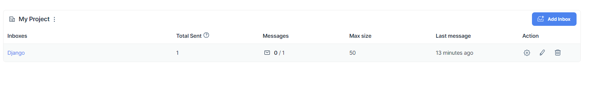
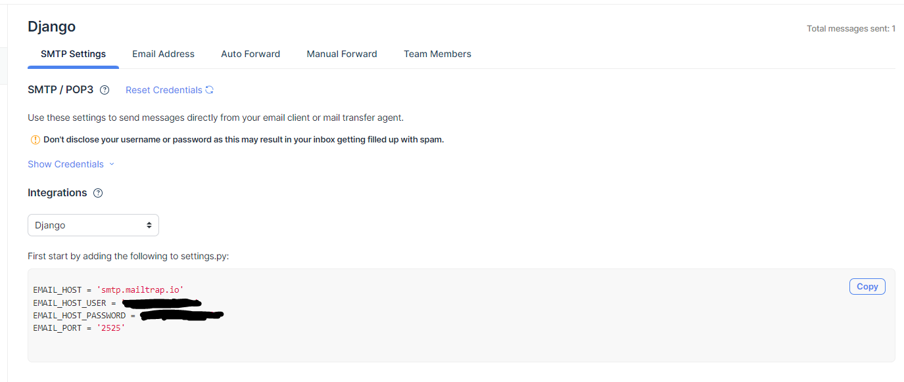

# Obnovení hesla

Lidé jsou zapomnětliví a může se stát, že někdo z uživatelů zapomene heslo. Djagno umožňuje použít standardní mechanismus změny hesla po ověřené e-mailu. My si zatím připravíme formulář na žádost uživatele o obnovení hesla. Formulář uložíme do šablony `password_reset_form.html`.

```html


<h2>Password Reset</h2>
<p>Please fillin the e-mail address of your account</p>
<form method="post">
    
        {{ form.as_p }}
        <button type="submit" class="btn btn-primary">Odeslat</button>
</form>

```

Jako druhý krok přidáme stránku, kam chceme uživatele přesměrové poté, co vyplní e-mail. Kód uložíme do šablony `password_reset_done.html`.

```html


<h2>Password Reset Finished</h2>

```

E-mail zatím odeslán není, protože nemáme nastavené připojení na server, který e-mail může odeslat.

## Nastavení služby Mailtrap

Ve fázi vývoje je jednodušší a bezpečnější e-maily neodesílat, ale pouze použít nějakou službu, která simuluje odesílání mailů. Příkladem takové služby je služba [Mailtrap](https://mailtrap.io/). Pro použití služby je nutné se nejprve zaregistrovat a oveřit e-mail.

Po přihlášení do aplikace je potřeba vytvořit novou mailovou schránku. K tomu slouží tlačítko `Add Inbox`. Té přiřadíme nějaké jméno (např. `Django`).



Po kliknutí na název schránky vidíme na záložce `SMTP Settings` nastavení schránky pro různá prostředí, která můžeme rovou překopírovat. Ve dlouhém seznamu nechybí `Djano`. Nastavení má pouze čtyři řádky, které zkopírujeme do souboru `settings.py`.



Nyní můžeme znovu vyzkoušet reset mailu. Pokud máme správně zkopírované nastavení a použijeme reset na adresu, kterou má nastavenou nějaký uživatel, zobrazí se v naší schránce e-mail. V něm vidíme text, který by byl odeslán uživateli. E-mail obsahuje stručný text a unikátní odkaz, který umožní zapomnětlivému uživateli nastavit nové heslo.


# Rozšíření modelu uživatele

U uživatele chceme často evidovat více informací, než kolik umožňuje klasický `User` model. U firemních aplikací je často potřeba uložit oddělení, telefonní číslo, pobočku či nadřízeného zaměstnance, u běžných komerčních aplikací (např. e-shopu) pak třeba doručovací adresu, odkazy na profily na sociálních sítích atd.

Django nabízí několik možností, jak rozšířit možnosti modelu `User`. Jednou z nich je vytvoření vlastní verze modelu, to je ale používáno především v situaci, kdy máme specifické požadavky (např. provádíme import uživatelů z jiné databáze). Pokud náme jde o přidání dodatečných polí, je možné přidat samostatný model (např. `Employee`) a k němu přidat vazbu `OneToOne` na model `Employee`. Dále k modelu `Employee` přidáme oddělení a telefonní číslo.

```py
class Employee(models.Model):
    user = models.OneToOneField(User, on_delete=models.CASCADE)
    department = models.CharField(max_length=100, blank=True)
    phone_number = models.CharField(max_length=20, blank=True)
```

Záznam modelu `Employee` by v ideálním případě měl být vytvořen při vytvoření záznamu mudelu `User`. To můžeme zařídit automaticky pomocí **signálů**. Signály jsou vysílány při různých operacích (např. uložení záznamu) a pokud se přihlásíme k odběru signálu, můžeme při operaci vždy provést nějakou akci. Vytvoříme tedy funkci `create_user_profile`, kterou označíme tzv. **dekorátorem** `@receiver` (přijímač). Funkce `create_user_profile()` bude mít parametry `sender` (odesílatel signálu), `instance` (upravovaný záznam), `created` (pravdivostní hodnota, která udává, jestli došlo k vytvoření nebo úpravě již existujícího záznamu) a pro případné další parametry je přítomen `**kwargs`.

```py
from django.db.models.signals import post_save
from django.dispatch import receiver

@receiver(post_save, sender=User)
def create_user_profile(sender, instance, created, **kwargs):
    if created:
        Employee.objects.create(user=instance)
```

Protože jsme vytvořili nový model, musíme provést migraci databáze.

```
python manage.py makemigrations
python manage.py migrate
```

Dále zaregistrujeme model pro zobrazení v administrátorském rozhraní.

```
admin.site.register(crm.models.Employee)
```

## Úprava informací o uživateli

Nejčastější případ úpravy dat o uživateli je, že si data upravuje sám uživatel. Aby si uživatel mohl své údaje upravit, přidáme na úpravu pohled `EmployeeUpdateView`. Využijeme `UpdateView`, přidáme ale metodu `get_object()`. Tato metoda je u třídy `UpdateView` čte ID záznamu, který upravujeme, z adresy. To by v našem případě nebylo správně, protože uživatel by měl mít možnost upravovat pouze své údaje (pokud není administrátor). Upravíme tedy metodu `get_object()`. Využijeme atribut `request`, což je objekt třídy `HttpRequest` a obsahuje různé informace o požadavku uživatele. Kompletní popis této třídy je možné najít [v dokumentaci](https://docs.djangoproject.com/en/4.0/ref/request-response/). Jedním z klíčových atrbitů požadavku je uživatel, který požadavek vyvolal. S uživatelem již umíme pracovat na úrovni šablony (např. při kontrole, zda je uživatel přihlášen), nyní ho využijeme v metodě `get_object()`. Atribut `user` je záznam třídy `User` a můžeme tak přistoupit přes jeho atribut `employee` k záznamu třídy `Employee`, což je přesně to, co potřebujeme.

```py
class EmployeeUpdateView(LoginRequiredMixin, UpdateView):
    template_name = "employee/update_employee.html"
    fields = ['department', 'phone_number']
    success_url = reverse_lazy("employee_update")

    def get_object(self, queryset=None):
        return self.request.user.employee
```

## Nepovinné čtení na doma - kombinace úprav obou modelů

Uvažujme trochu složitější zadání. Nyní chceme umožnit uživateli úpravu údajů v modelu `User` i `Employee` na jedné stránce. V takovém případě už za nás `UpdateView` celý problém nevyřeší, protože to počítá s úpravou jednoho záznamu.

Začneme s tím, že si vytvoříme formuláře jako třídy v souboru `forms.py`. Vytvoříme samostatný formulář pro úpravu údajů v modelu `User` a samostatný formulář pro úpravu údajů v modelu `Employee`. V Django můžeme používat dva typy formulářů:

- obecné, které dědí od třídy `Form` a nemusí být napojeny na žádný model,
- formuláře zaměřené na úpravu dat v modelech, které dědí od třídy `ModelForm`.

V našem případě je vhodnější použití `ModelForm`. Vytvoříme nejprve třídu `UserForm` a do ní vložíme "vnořenou" třídu `Meta`, které nastavíme atributy `model` a `fields`. Nastavení hodnot těchto atributů má stejnou logiku, jako mělo jejich nastavení přímo na pohled.

```py
from django.forms import ModelForm
from crm.models import Employee
from django.contrib.auth.models import User


class UserForm(ModelForm):
    class Meta:
        model = User
        fields = ['first_name', 'last_name', 'email']

class EmployeeForm(ModelForm):
    class Meta:
        model = Employee
        fields = ['department', 'phone_number']
```

Nyní upravíme pohled `EmployeeUpdateView`. Odebereme nejprve atribut `fields` a nahradíme ho atributem `form_class`, kde použijeme formulář `EmployeeForm`. Tím máme vyřešené úpravy dat v modelu `Employee`. Následně musíme zařídit zobrazení formuláře na úpravu dat v modelu `User`. 

Přidáme metodu `get_context_data()`. Kontext je vlastně jen slovník, který obsahuje seznam proměnných, které jsou k dispozici uvnitř šablony. My nejprve necháme vytvořit kontext metodou `get_context_data()` mateřské třídy `UpdateView` (abychom nepřišli o proměnnou `form`, kde bude vložen formulář `EmployeeForm`) a následně vložíme klíč `user_form`, který bude obsahovat formulář `UserForm`. Formuláři `UserForm` při vytváření přiřadíme jako parametr `instance` aktuálně přihlášeného uživatele, kterého opět zjistíme z atributu `request.user`.

Dále se musíme postarat o uložení výsledných hodnot. K tomu můžeme využít metodu `post()`, která je zavolána vždy, když uživatel uloží formulář. Při ukládání opět nejprve vytvoříme instanci třídy `UserForm`, které navíc kromě parametru `instance` dáme slovník hodnot, který obsahuje data zadaná uživatelem. Slovník je opět součástí objektu `request`, konkrétně atributu `request.POST`. Dále provedeme kontrolu, že je formulář vyplněný korektně, k čemuž slouží metody `is_valid()`. Pokud tato metoda vrátí hodnotu `True`, provedeme uložení změn pomocí metody `save()`.

```py
from crm.forms import EmployeeForm, UserForm

class EmployeeUpdateView(LoginRequiredMixin, UpdateView):
    template_name = "employee/update_employee.html"
    form_class = EmployeeForm
    success_url = reverse_lazy("employee_update")

    def get_object(self, queryset=None):
        return self.request.user.employee

    def get_context_data(self, **kwargs):
        context = super().get_context_data()
        context["user_form"] = UserForm(instance=self.request.user)
        return context

    def post(self, request, *args, **kwargs):
        user_form = UserForm(request.POST, instance=request.user)
        if user_form.is_valid():
            user_form.save()
        return super().post(request, *args, **kwargs)
```

Poslední změna se týká šablony `update_employee.html`, do které přidáme vložení formuláře pomocí `{{ user_form.as_p }}`.

```py


<h1>Create new company</h1>
<form method="post">
    
    {{ user_form.as_p }}
    {{ form.as_p }}
    <button type="submit" class="btn btn-primary">Uložit</button>
</form>

```

# Zprávy

Pokud uživatel provede nějakou akci (např. upraví nějaký záznam), určitě uvítá, pokud ho informujeme o úspěšném uložení jím provedených změn. Tyto zprávy v rámci Django označujeme jako `messages`. To, aby pohled uměl se zprávami pracovat, zařídíme tím, že mu mezi mateřské třídy přidáme `SuccessMessageMixin`. Mateřský pohled `UpdateView` umí se zprávami již pracovat, pouze mu tedy musíme říct, jako zprávu má zobrazit, pokud došlo k úspěšné úpravě záznamu. To uděláme pomocí atributu `success_message`.

```py
from django.contrib.messages.views import SuccessMessageMixin

class EmployeeUpdateView(LoginRequiredMixin, SuccessMessageMixin, UpdateView):
    template_name = "employee/update_employee.html"
    fields = ['department', 'phone_number']
    success_url = reverse_lazy("employee_update")
    success_message = "Data was updated successfully"

    def get_object(self, queryset=None):
        return self.request.user.employee
```

Následně musíme zařídit zobrazení zprávy v šabloně, a to především její správné naformátování. Framework Bootstrap má komponentu [Alerts](https://getbootstrap.com/docs/4.0/components/alerts/), která slouží ke stejnému účelu, tj. k zobrazení zpráv. U zpráv rozlišujeme především jejich typ, podle kterého je zpráva barevně vyznačena. Správnou třídu pak zvolíme pomocí třídy.

Zpráv teoreticky může být více, proto jsou uloženy v seznamu `messages`. Začneme kontrolou, zda v seznamu vůbec nějaká zpráva je, což zařídíme pomocí podmínky ``. Poté pomocí cyklu projdeme všechny zprávy k zobrazení pomocí cyklu `for`. Každou právu vložíme do tagu `<div>`, který musí mít nastavenou třídu `alert` a následně třídu pro příslušný typ zprávy. Ten je uložený v atributu `tag` dané zprávy, tj. zobrazíme ho pomocí `{{ message.tags }}`.

```html


<div class="alert {{ message.tags }}" role="alert">
    {{ message }}
</div>


```

Správná třída není vložena automaticky, ale na základě nastavení. Do souboru `settings.py` vložíme slovník `MESSAGE_TAGS`, který má jako klíče typy zpráv a jako hodnoty tagy, které jsou následně "přilepeny" na každou ze zpráv dle jejího typu. Zatím používáme pouze typ `messages.SUCCESS` a tomu nastavíme hodnotu `alert-success`, což je vhodná třída dle dokumentace frameworku Bootstrap.

```py
from django.contrib.messages import constants as messages

MESSAGE_TAGS = {
    messages.SUCCESS: 'alert-success',
}
```

Pokud byste rovnou chtěli přidat i další třídy, můžete si zkopírovat slovník například ze článku [How to use Django Messages Framework](https://ordinarycoders.com/blog/article/django-messages-framework).

