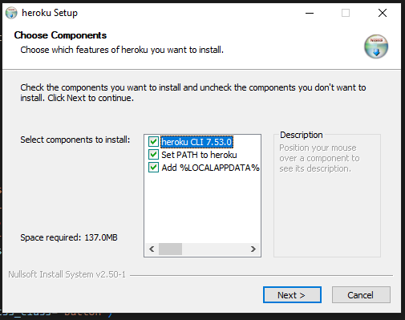

# Deployment na Heroku

Nyní vyzkoušíme nahrání aplikace na server, aby byla dostupná uživatelům. Využijeme službu [Heroku](https://www.heroku.com/home), která nabízí základní verzi služby zdarma. Do služby je nutné se zaregistrovat, což lze provést na [této stránce](https://signup.heroku.com/) a následně se přihlásit. Dále je potřeba nainstalovat **klienta** pro příkazový řádek Heroku CLI. Na [této stránce](https://devcenter.heroku.com/articles/heroku-cli) jsou k dispozici instalační soubory a návody pro Windows, MacOS i Linux. Před instalací klienta je potřeba mít nainstalovaného [Git klienta](https://git-scm.com/book/en/v2/Getting-Started-Installing-Git).

Při instalaci na Windows je potřeba **nechat zaškrtnuté** všechny možnosti v prvním okně instalačního průvodce.



Řádnou instalaci klienta ověříme zadáním příkazu

```
heroku --version
```

do termínálu. Pokud je vše v pořádku, zadáme příkaz

```
heroku login
```

Tímto příkazem se přihlásíme do klienta. Přihlášení probíhá prostřednictvím webového prohlížeče. Po stisknutí libovélné klávesy se otevře okno webového prohlížeče, kde potvrdíme přihlášení kliknutím na tlačítko. Přihlášení lze ověřit příkazem

```
heroku auth:whoami
```

Aplikaci můžeme vytvořit pomocí příkazu

```
heroku create
```

Pokud chceme nastavit, jaký název by naše aplikace měla mít a jakou by měla mít doménu 3. řádu, zadáme název jako parametr. Název musí být v rámci služby Heroku unikátní. Pokud zadáme název, který není unikátní, aplikace  nás na to upozorní.

```
heroku create company-manager-jirka
```

Řádné vytvoření aplikace můžeme zkontrolovat příkazem:

```
heroku apps
```

Následně musíme v našem projektu vytvořit soubor `runtime.txt`, který označí verzi Pythonu, se kterou by naše aplikace měla běžet.

```
runtime.txt
```

Do souboru můžeme vložit například následující řádek

```
python-3.9.6
```

Soubor musíme přidat do Gitu.


Následně vytvoříme soubor `Procfile`, který bude obsahovat příkaz, pomocí kterého je aplikace spuštěna.

```
web: python company_manager/manage.py runserver 0.0.0.0:$PORT
```

Jednotlivé konfigurační hodnoty je možné nastavit pomocí příkazu `heroku config`. Můžeme pomocí něj nastavit `SECRET_KEY`. Ten může být klidně jiný, než jaký používáme na lokální vývoj. Nejprve si můžeme nový `SECRET_KEY` vygenerovat.

```py
from django.core.management.utils import get_random_secret_key
print(get_random_secret_key())
```

A následně ho uložíme do služby `heroku`.

```
heroku config:set SECRET_KEY="#=+@u3v6d-hj1j9n90(move#@lrw!&17w*pwx09(zeqfjl2386"
```

Dále je potřeba doinstalovat modul `django-heroku`

```
pip install django-heroku
```

**Na konec** souboru s nastavením `settings.py` vložíme následující řádky, které zajístí nahrání konfiguračních hodnot z Heroku.

```py
import django_heroku

django_heroku.settings(locals())
```

Spuštění můžeme otestovat pomocí příkazu

```
heroku local --port=8000
```

Pokud by příkaz nefungoval (především na Windows), je možné dočasně nahradit vložení proměnné `$PORT` číslem `8000`.

```
git push heroku master
```

## Nastavení databáze

Zadáme-li příkaz

```
heroku addons
```

uvidíme, že doplňkem naší aplikace je `heroku-postgresql`, tedy databáze PostgreSQL. Vygenerování a nastavení aplikace provádí služba Heroku automaticky. Nastavení můžeme zkontrolovat příkazem

```
heroku config
```

Výstupem příkazu je kromě námi přidaného `SECRET_KEY` i řetězec `DATABASE_URL`, což je adresa naší databáze (včetně hesla).

```
=== company-manager-jirka Config Vars
DATABASE_URL: postgres://XX:XX@ec2-54-165-184-219.compute-1.amazonaws.com:5432/XX
SECRET_KEY:   XX
```

Stav databáze můžeme zkontrolovat příkazem

```
heroku pg
```

Dále potřebujeme provést migraci databáze. K tomu, abychom mohli spouštět pro aplikaci na vzdáleném serveru příkazy, můžeme použít příkaz `heroku run`, za který přidáme příkaz, který chceme spustit.

```
heroku run python company_manager/manage.py migrate
```

Tento krok můžeme i automatizovat, a to tím, že jej přidáme jako další řádek do souboru `Procfile`

```
web: python company_manager/manage.py runserver 0.0.0.0:$PORT
release: python company_manager/manage.py migrate
```

```
heroku run bash
```

```
python company_manager/manage.py createsuperuser
```

```py
CSRF_TRUSTED_ORIGINS = [
    "https://company-manager-jirka.herokuapp.com"
]
```

## Řešení problémů

Pokud aplikace neběží, na webu zpravidla vidíme pouze jednoduchou hlášku, která nám nic neřekne. Při pátrání po příčinách problému je dobré podívat se do logu, který obsahuje výpis zpráv, jaké vidíme v terminálu.

Pokud spustíme příkaz

```
heroku logs --tail
```

uvidíme několik posledních zpráv a navíc se nám budou zobrazovat nové zprávy, které jsou vygenerovány. Pokud tedy např. obnovíme stránku aplikace pomocí F5, v terminálu se objeví jeden či více nových řádků.

# Cvičení

## Deployment projektu

Proveď deployment svého projektu na službu Heroku.

- Projekt musí být nahraný na Gitu. Pokud ho nahraný nemáš, nahraj ho do nového repozitáře.
- Vytvoř aplikaci s novým jménem pod svým účtem.
- Proveď všechny úpravy a příkazy, které jsme prováděli v rámci lekce, a zkontroluj, že projekt byl řádně nahrán.
