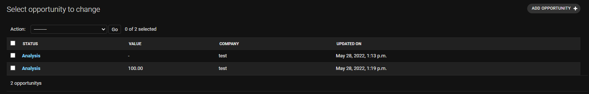
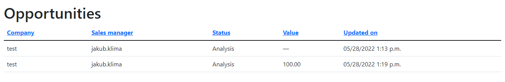
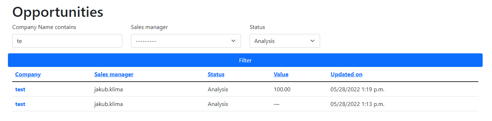

# CK Editor

Nakonec si vyzkoušíme přidat editor, který umožní uživatelům snadno vytvářet formátovaný obsah. Takový editor se hodí například k editaci článků zpravodajského serveru nebo popisu produktu v e-shopu. Jako editor použijeme [CK Editor](https://ckeditor.com/), což je editor vytvořený v jazyce JavaScript a nabízí spoustu různých možností nastavení. K CK Editoru existuje modul `django-ckeditor`, který nám umožní snadno využít CK Editor v naší aplikaci.

```py
INSTALLED_APPS = [
    # Ostatní hodnoty necháme v seznamu
    "ckeditor",
]
```

Do naší aplikace musíme přidat zdrojový kód CK Editoru. K tomu vytvoříme adresář `static` v kořenovém adresáři Django projektu a do něj stáhneme a rozbalíme [CK editor](https://ckeditor.com/ckeditor-5/download/).

```py
STATIC_ROOT = "static/"
CKEDITOR_BASEPATH = "/static/ckeditor/ckeditor/"
```

Nyní k modelu `Company` přidáme nové pole typu `RichTextField`.

```py
from ckeditor.fields import RichTextField

class Company(models.Model):
    # Ostatní pole ponecháme
    notes = RichTextField()
```

A nakonec přidáme pole `notes` i do formuláře `CompanyForm`, kde mu nastavíme `widget=CKEditorWidget`.

```py
from ckeditor.widgets import CKEditorWidget

class CompanyForm(ModelForm):
    notes = CharField(widget=CKEditorWidget())

    class Meta:
        model = Company
        # Sem přidáme pole notes
        fields = ["name", "status", "phone_number", "email", "identification_number", "notes"]
```

# Časové zóny

Django je připravené na vývoj globálních aplikací, které používají uživatelé z různých částí světa. Kromě podpory překladů do různých jazyků je pak nutné počítat i s tím, že aplikaci budou používat lidé nacházející se v různých časových pásmech. Django tedy ve výchozím nastavení ukládá ke všem časovým údajům ukládá informace o časové zóně.

Uvažujme třeba, že bychom chtěli u každého obchodního případu ukládat, kdy byl založen. Přidáme tedy pole `created_on`, kterému nastavíme parametr `auto_now_add=True`. Do pole se pak automaticky vloží datum a čas **vytvoření** záznamu. Dále přidáme pole `updated_on`, kde nastavíme parametr `auto_now=True`. Hodnota pole bude aktualizována při **každé úpravě** záznamu.

```py
class Opportunity(models.Model):
    # Přidáme nové pole
    created_on = models.DateTimeField(auto_now_add=True, null=True)
    updated_on = models.DateTimeField(auto_now=True, null=True)
```

Nesmíme zapomenou na migraci databáze.

```
python manage.py migrate
python manage.py makemigrations
```

V administrátorském rozhraní si můžeme zobrazit pole `updated_on`.

```py
class OpportunityAdmin(admin.ModelAdmin):
    list_display = ["status", "value", "company", "updated_on"]
```

Výsledek v administrátorském rozhraní vidíme níže. Oproti datu a času, který vidíme na hodinách, je údaj posunutý. Zobrazuje se totiž v jiném časovém pásmu.



Časové pásmo, které je použito, je v souboru `settings.py` nastaveno v jako kontanta `TIME_ZONE`. Spolu s ní je v `settings.py` konstanta `USE_TZ`, pomocí které můžeme používání časových zón vypnout. Pokud hodnotu nastavíme jako `False`, budou všechna data ukládána a zobrazována v časové zóně, která je uvedená v hodnotě `TIME_ZONE`.

```py
TIME_ZONE = 'UTC'
USE_TZ = True
```

K časovým zónám se ještě vrátíme, ale nyní přejděme k tabulkám.

# Modul django-tables2

Pro práci s tabulkami existuje modul `django-tables2`, který za nás zařídí zobrazení tabulky v pěkném formátu, stránkování a další věci. Po instalaci modulu přidáme do seznamu `INSTALLED_APPS` v souboru `settings.py` položku `django_tables2`. Dále bychom pro naše tabulky měli zvolit šablonu. Modul `django-tables2` bohužel zatím nepodporuje Bootstrap 5, vybereme tedy variantu pro Bootstrap 4. Hodnotu uložíme do konstanty `DJANGO_TABLES2_TEMPLATE`.

```py
INSTALLED_APPS = (
    ...,
    "django_tables2",
)

DJANGO_TABLES2_TEMPLATE = "django_tables2/bootstrap4.html"
```

Dále vytvoříme samotnou tabulku. Tabulka je třída, která dědí od třídy `Table`. Pro přehlednost je nejlepší všechny tabulky ukládat do samostatného souboru `tables.py`. Vytvoříme novou třídu `OpportunityTable`, která bude reprezentovat tabulku s obchodními případy. Samostné nastavení je prováděno stejně jako u formulářů, tj. pomocí vnořené třídy `Meta`. Té nastavíme atributy `model` a `fields`.

```py
import django_tables2 as tables
from crm.models import Opportunity

class OpportunityTable(tables.Table):
    class Meta:
        model = Opportunity
        fields = ("company", "sales_manager", "status", "value", "updated_on")
```

Dále upravíme pohled `OpportunityListView`, kde tabulku zobrazíme. Nově bude pohled dědit od třídy `SingleTableView`. Jako atribut `table_class` nastavíme vytvořenou tabulku `OpportunityTable`.

```py
import crm.tables as tables
from django_tables2 import SingleTableView

class OpportunityListView(LoginRequiredMixin, SingleTableView):
    model = models.Opportunity
    table_class = tables.OpportunityTable
    template_name = "opportunity/list_opportunity.html"
```

Jako poslední krok je potřeba upravit šablonu `list_opportunity.html`. Pro vykreslení tabulek nahrajeme nejprve tag `render_table` a následně ho použijeme, abychom vykresili tabulku, která je uložená v proměnné `table`.

```



    <h1>Opportunities</h1>
    

```

Výsledek vypadá takto.



## Úprava tabulky

Nedostatkem naší tabulky je, že se uživatel nemůže proklikat na pohled pro úpravu obchodních případů, protože žádný sloupeček nefunguje jako odkaz. Pokud chceme, aby nějaký sloupeček fungoval jako odkaz, musíme jej vytvořit jako atribut třídy `LinkColumn`. Té jako první parametr dáme název adresy, na který odkaz má vést, a jako parametr `args` vložíme seznam argumentů, které pro otevření adresy potřebujeme. V tomto případě je to primární klíč (`pk`) obchodního případu. Ten vložíme pomocí třídy `A` (zkratka od `Accessor`) z modulu `django_tables2.utils`.

Další možností, kterou modul nabízí, je úprava vzhledu. Protože podtržení nevypadá příliš esteticky, pokusíme se ho zbavit pomocí CSS třídy. Pomocí parametru `attrs` vložíme dvourozměrný slovník, kde klíče vnějšího slovníku tvoří názvy tagů, klíče vnitřního slovníku názvy atributů a jejich hodnoty jsou požadované hodnoty atributů. V případě sloupce `LinkColumn` můžeme jako tag použít `a`, protože tento tag určitě ve sloupci s odkazem musí být. Pro všechny typy sloupců jsou k dispozici `tr`, `td` a `cell`. Nastavíme tedy odkazu třídu (`class`) `cell-with-link`.

```py
from django_tables2.utils import A

class OpportunityTable(tables.Table):
    company = tables.LinkColumn("opportunity_update", args=[A("pk")],
                                attrs={"a": {"class": "cell-with-link"}})
```

Třídu musíme dále vytvořit. Odkaz nastavíme jako nepodtržený (`text-decoration-line: none`) a tučný (`font-weight: bold`).

```css
.cell-with-link {
    font-weight: bold;
    text-decoration-line: none;
}
```

## Modul django-filter

Uživatelé si často chtějí zobrazit jen část záznamů, v našem případě to mohou být obchodní případy určité firmy nebo v určitém stavu. Pro výběr specifických záznamů můžeme využít modul `django-filter`, který lze využívat spolu s modulem `django-tables2`. Na začátku postupujeme klasicky - modul nainstalujeme a přidáme do seznamu `INSTALLED_APPS`.

```py
INSTALLED_APPS = [
    ...
    'django_filters',
]
```

Dále vytvoříme filter. Stejně jako u tabulek je nejlepší ukládat filtry do samostatného souboru, který pojmenujeme `filters.py`.  Filtr vytvoříme jako třídu, která dědí od třídy `FilterSet`. Nastavení třídy je pak stejné jako u tabulky nebo formuláře, tj. s využitím vnořené třídy `Meta`.

```py
import django_filters
from crm.models import Opportunity

class OpportunityFilter(django_filters.FilterSet):
    class Meta:
        model = Opportunity
        fields = ['company', 'sales_manager', "status"]
```

Dále se musíme rozhodnout, jak filtr vykreslit. Filtr je ve své podstatě formulář, k jeho vykreslení můžeme použít modul `django-crispy-forms`. Vytvoříme tedy `helper`, který říká, jak má být formulář vykreslený. Helper vytvoříme jako samostatnou třídu `OpportunityFilterFormHelper`, která bude dědit od třídy `FormHelper`.

```py
from crispy_forms.helper import FormHelper
from crispy_forms.layout import Layout, Submit, Div

class OpportunityFilterFormHelper(FormHelper):
    form_method = 'GET'
    layout = Layout(
            Div(
                Div("company", css_class="col-sm-3"),
                Div("sales_manager", css_class="col-sm-3"),
                Div("status", css_class="col-sm-2"),
                Submit('submit', 'Filter', css_class='button'),
                css_class="row"
            )
        )
```

Nakonec je potřeba upravit pohled `OpportunityListView`. U něj upravíme dědičnost, na druhé místo (po `LoginRequiredMixin`) vložíme `SingleTableMixin` a za něj `FilterView`. Pohled je tedy připravený jak na tabulku, tak na filtr. Dále je potřeba přidat atribut `filterset_class`, který bude mít hodnotu `OpportunityFilter`. Jako poslední krok je potřeba vložit metodu `get_filterset`, která zajistí přiloží `helper` k formuláři s filtrem. Nejprve zavoláme metodu `get_filterset()` mateřské třídy `FilterView`, ze které získáme filter jako proměnnou `filterset`. K atributu `form` proměnné `filterset` pak jako atribut `helper` vložíme objekt třídy `OpportunityFilterFormHelper`.

```py
class OpportunityListView(LoginRequiredMixin, SingleTableMixin, FilterView):
    model = models.Opportunity
    table_class = tables.OpportunityTable
    template_name = "opportunity/list_opportunity.html"
    filterset_class = OpportunityFilter

    def get_filterset(self, filterset_class):
        filterset = super().get_filterset(filterset_class)
        filterset.form.helper = OpportunityFilterFormHelper()
        return filterset
```

Jako poslední krok upravíme šablonu. Přidáme tagy `crispy_forms_tags` a pomocí tagu `crispy` vyrenderujeme formulář s filtrem.

```




    <h1>Opportunities</h1>
    
    

```



